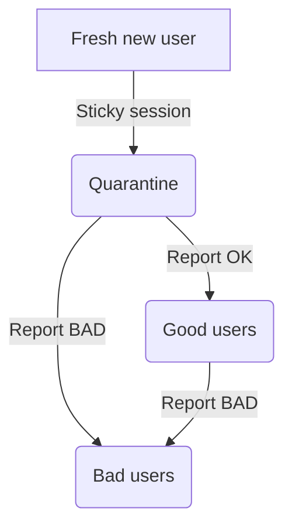

# kvirin_message

Kvirin Message for DEMHACK 4

## Components

All components are parts of docker containers:

1. Database (redis) - `db`
2. API module - `api`
3. Signal bot module - `signal`

## Metrics

Metrics are exposed over `/metrics` *prometheus* endpoint.

TODO: metrics list

## API

TODO: add description

## Configuration

An example configudation:

```yaml
pools:
  bad:
    features:
      - feature: is_bad
        value: true
    bridges:
      - bad_1
      - bad_2
      - bad_3
      - bad_4
```

Here we create a pool with 4 bridges inside & 1 predicate feature

## Anti-enumeration algo

1. *Different pools* - admin is able to configure different pools with different alighment mechanisms.
2. *Sticky sessions* - Inside pools, users are assigned randomly.
3. *User karma* - we can track users carma by IP (±1 per time interval) via `/report` endpoint.



### Potential improvements

1. Penalize for a specific vector. not for the whole world. Like "bad in China".
2. Right now, sticky sessions are reset on a service restart. Probably, they should not.

## Authors

* TODO
* TODO
* Aleksei Kaplin <aleksei.kaplin.2021@gmail.com>
* TODO

Special thanks:

* TODO
